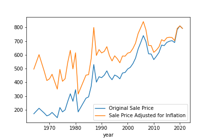
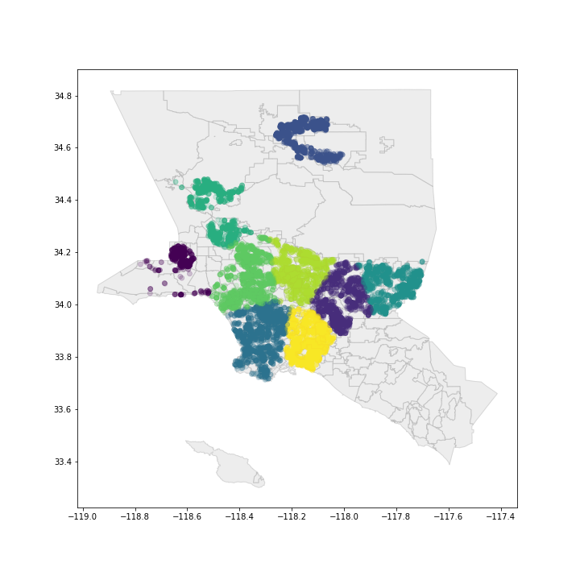

# Project Overview
* Created a tool that estimates the prices of Single Family Houses in Los Angeles that will help home buyers find their ideal house within their budget.
* Scraped over 10,000 properties across LA County.
* Engineered features to quantify the value of location, time, and other home attributes on the sale price.
* Optimized a XGBoost regressor, Random Forest Regressor and a Linear Model using hyperopt to find the best model.
* Built a client facing application using the Streamlit framework.

Link: https://share.streamlit.io/swondim24/realestateavm/Streamlit/app.py

### Code and Resources
**Python Version:** 3.7 
**Packages:** pandas, numpy, matplotlib, seaborn, sklearn, BeautifulSoup, feature_engine, geopandas, hyperopt, XGBoost, pickle, folium 
**For Web Framework Requirements:** `pip isntall -r requirements.txt` 
**Data:** http://realtytrac.com/ 

### **Data Collection** 
Periodically scrape data from RealyTrac and obtained 25 features for over 19,000 unique properties while also retrieving sales history for most of those properties. Some of the features include... 
* Geolocation
* Home Size
* Lot Size
* Bedrooms
* Bathrooms
* Neighborhood Information (school quality, crime index, etc.)

### **Data Cleaning** 
In order to prepare the data for the model I needed to
* Parse out bedroom and bathroom into their own columns.
* Standardize the unit used for measuring home size and lot size by converting all properties values that were listed in acres into sqft.
* Parse out the numeric data from sale price.
* Convert the rest of the features into and appropriate data type(i.e Date converts to Date object).
* Merged the sales history data the original dataframe.
  * Adjusted the sale price for inflation
  
* Dummy Encoded the categorical features
  * crime_index
  * school_quality

### **Geographic Information System**
* Used KMeans clustering to identify 9 clusters around Los Angeles.
* Calculated the distance between each house and the cluster centers to quantify the value of the location of the house.

### **Exploratory Data Analysis**
The sale price was heavily skewed to the right so I used a Power Transformer on the sale price to approximate a normal distribution

### **Model Building**
* Used a XGBoost regressor, Random Forest Regressor and a linear regression model.
 * Wanted to use all models to compare performance.
* Split the dataset into train and test set and since the dataset was large, I decided to use a validation set when tuning the hyperparameters.
* Used Mean Absolute Percent Error (MAPE) as the evaluating metric.

### **Model Performance**
* XGBoost Regressor: 30.74%
* Random Forest Regressor:

### Productionization
Built an application that estimates the prices of houses based on a number of features. The application allows the user to get a good idea of the home buying process in Los Angeles. I deployed the application using the Streamlit Framework.
